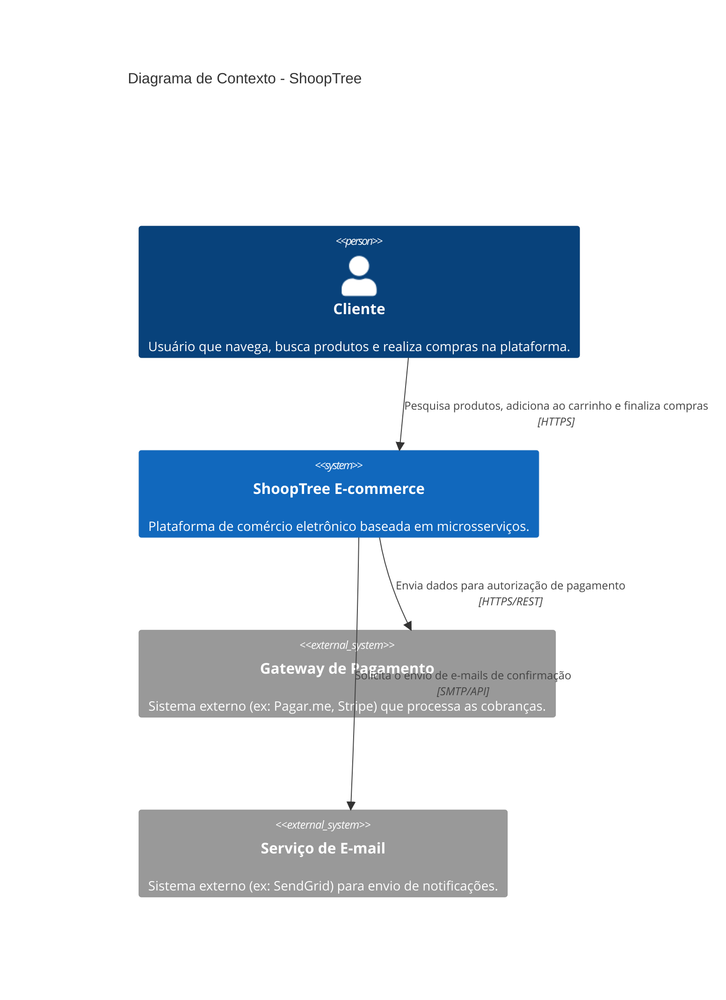
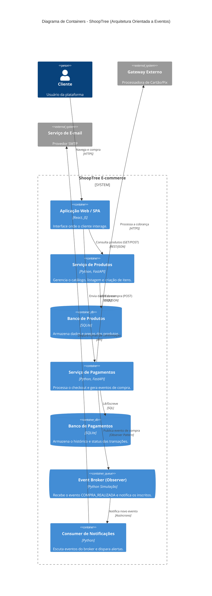

# ShoopTree - Modernização Arquitetural 🚀

Prova de Conceito (PoC) desenvolvida para a disciplina de Software Architecture & Design Patterns. O projeto demonstra a modernização da plataforma de e-commerce ShoopTree, migrando de uma arquitetura monolítica para Microsserviços com Comunicação Orientada a Eventos.

## 🏛️ Descrição da Arquitetura
A ShoopTree enfrentava problemas graves de escalabilidade, alto tempo de implantação e falhas em cascata geradas pelo seu sistema monolítico inicial. 

Para solucionar esses gargalos, a arquitetura foi redesenhada para o modelo de **Microsserviços Orientados a Eventos (EDA)**. Essa abordagem garante:
* **Desacoplamento:** Serviços funcionam de forma independente. Se o serviço de pagamentos cair, o catálogo de produtos continua operando.
* **Bancos de Dados Isolados:** Cada microsserviço possui seu próprio banco de dados (SQLite), evitando o anti-pattern de banco de dados compartilhado.
* **Escalabilidade Seletiva:** Funcionalidades com maior tráfego podem ser escaladas individualmente.

## 📦 Explicação dos Serviços
Foram implementados dois microsserviços independentes utilizando Python e FastAPI[cite: 1]:

1. **Serviço de Produtos (`produtos_service.py`)**
   * **Responsabilidade:** Gerenciar o catálogo de itens do e-commerce.
   * **Endpoints:** `GET /produtos` (lista os itens) e `POST /produtos` (cadastra um novo item)[cite: 1].
   * **Persistência:** Utiliza um banco de dados SQLite isolado (`produtos.db`).

2. **Serviço de Pagamentos (`pagamentos_service.py`)**
   * **Responsabilidade:** Processar transações financeiras dos pedidos.
   * **Endpoints:** `GET /pagamentos` (lista as transações) e `POST /pagamentos` (processa um pagamento)[cite: 1].
   * **Persistência:** Utiliza um banco de dados SQLite isolado (`pagamentos.db`).

## 🔄 Simulação do Evento e Justificativa do Design Pattern
Para simular a Arquitetura Orientada a Eventos (sem a necessidade de subir uma infraestrutura complexa como o Apache Kafka), foi implementado o padrão de projeto **Observer** (Comportamental)[cite: 1].

* **O Evento Simulado:** Quando uma compra é finalizada, um evento do tipo `COMPRA_REALIZADA` é disparado[cite: 1]. O sistema que gerou a compra não sabe o que acontece depois (baixo acoplamento). Os serviços de "Pagamento" e "Notificação" escutam esse evento e executam suas tarefas de forma assíncrona (cobrar o cliente e enviar e-mail)[cite: 1].
* **Justificativa do Padrão Observer:** O Observer foi escolhido porque ele define perfeitamente a dependência um-para-muitos exigida por um Message Broker[cite: 1]. Ele permite que um objeto (*Subject*/Produtor) notifique automaticamente múltiplos objetos dependentes (*Observers*/Consumidores) sobre mudanças de estado, garantindo a autonomia e o isolamento dos serviços da ShoopTree.

---

## 🚀 Instruções de Execução

Siga os passos abaixo para rodar a Prova de Conceito na sua máquina local[cite: 1].

### 1. Clonar o repositório e preparar o ambiente
```bash
git clone [https://github.com/juanhenrique1306/shooptree-architecture.git](https://github.com/juanhenrique1306/shooptree-architecture.git)
cd shooptree-architecture

# Instalar dependências
pip install fastapi uvicorn pydantic
```

## Diagramas da Nova Arquitetura

### Diagrama de Contexto

